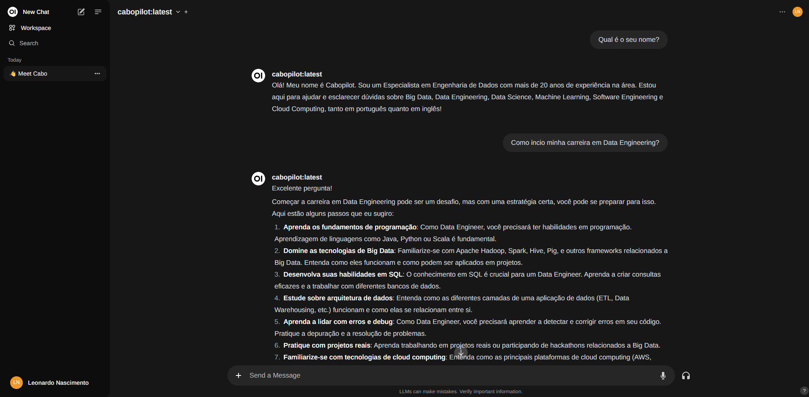

# cabopilot-llm
This repository hosts a POC of a customized Large Language Model (LLM) specifically tailored to support beginner Data Engineers in their learning and development journey.



## Disclaimer

The author is not responsible for any damage caused by the misuse of the tool.

The project was developed using widely used open-source tools by the community and does not hold any rights or obligations regarding the use or data provided to it.

All information exchange is strictly local, nothing is shared or accessed by third parties. Once used safely and responsibly, you will have full control over the provided and generated data.

`Important: This LLM custom model runs over NVIDIA Graphic Cards!`

## Pre Requeriments

### System

Make sure you have `Ubuntu` or `WSL Ubuntu` installed in their latest version `24.04 LTS`.

### Docker Environment

Make sure you have `Docker` and `Docker Compose` installed in their latest versions in your development environment (`>= 1.28.0`).

### NVIDIA Graphic Card

To avoid the error **"could not select device driver 'nvidia' with capabilities: [[gpu]]"**, you need to enable GPU acceleration in the container. To make it follow all steps bellow:

Install the NVIDIA Docker Toolkit: Make sure that the NVIDIA Docker Toolkit is installed. It is required for Docker to utilize NVIDIA GPUs. Install NVIDIA Docker support with the following command:

```bash
distribution=$(. /etc/os-release;echo $ID$VERSION_ID) \
  && curl -s -L https://nvidia.github.io/nvidia-docker/gpgkey | sudo apt-key add - \
  && curl -s -L https://nvidia.github.io/nvidia-docker/$distribution/nvidia-docker.list | sudo tee /etc/apt/sources.list.d/nvidia-docker.list
```

Next, update the package and install nvidia-docker2:

```bash
sudo apt-get update && sudo apt-get install -y nvidia-docker2
```

Finally, restart the Docker service:

```bash
sudo systemctl restart docker
```

Check NVIDIA Driver Installation: Make sure that the NVIDIA driver is correctly installed on your system. You can verify this with the following command:

```bash
 nvidia-smi
```

Update Docker Compose: GPU support in Docker Compose requires version `1.28.0` or higher. Make sure your Docker Compose version is up to date.

## Setup

### Start Docker Services

To create docker network POC, execute:

```bash
cd /ollama && make network-create NETWORK=poc
```

To start the Ollama service, run:

```bash
make build up
```

To start the OpenWebUI service, run:

```bash
cd ../openwebui/ && make build up
```

### Customize the Cabopilot

To customize our Data Engineering assistant locally, follow the steps below:

Pull the base model `llama3`: 

```bash
make model-pull
```

Customize a new model `cabopilot` based on `llama3`:

```bash
make model-custom
```

Finally, run the new model `cabopilot`:

```bash
make model-run
```

Ask questions and have fun, to exit execute `ctrl + d`.

### Access the Cabopilot from OpenWebUI

Check if each service is running correctly accessing:

```
- Ollama: http://localhost:11434/
- OpenWebUI: http://localhost:3000/
```

Create a admin account for tests, you can use a fake credentials sush as:

```
Full Name: Admin Admin
Email: admin@cabopilot.com
Password: cabopilotpass
```

On the left top selector pick the model:

```
cabopilot:latest
```

Ask questions and have fun!

### Stop Docker Services

To stop the Ollama service, run:

```bash
cd /ollama && make down
```

To start the OpenWebUI service, run:

```bash
cd ../openwebui && make down
```

## References

### Ollama:

- repository: https://github.com/ollama/ollama
- dockerhub: https://hub.docker.com/r/ollama/ollama

### OpenWebUI

- site: https://openwebui.com/ 
- documentation: https://docs.openwebui.com/